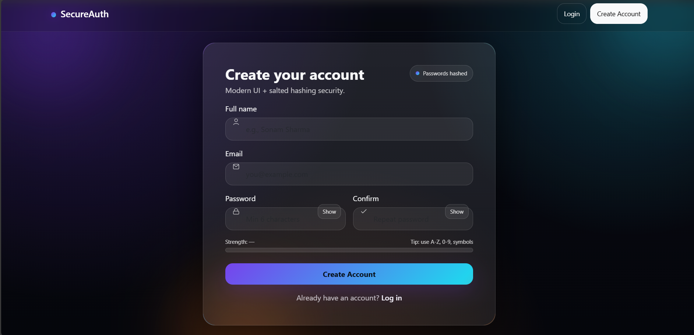
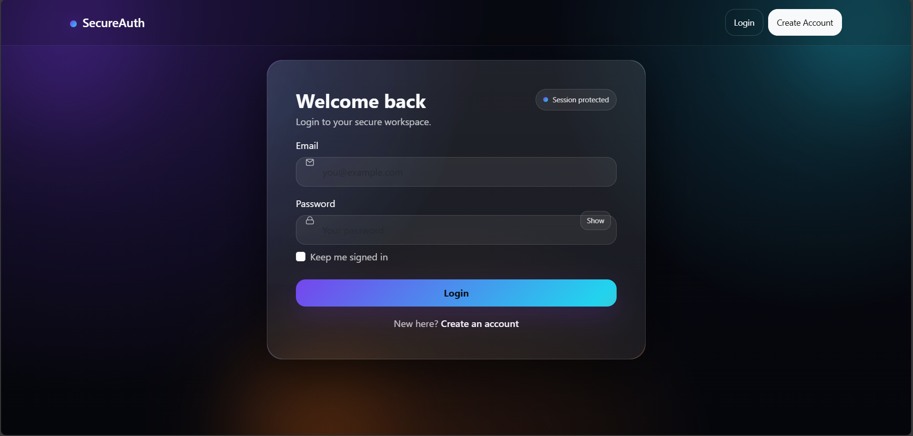

<div align="center">

# 🔐 SecureAuth
### Advanced Flask Authentication System

<p>
Production-style authentication system built with Flask, secure password hashing,
session protection, and a premium animated UI.
</p>


</div>

---

# 🚀 Overview

**SecureAuth** is a production-structured authentication system demonstrating:

- Secure password hashing (scrypt)
- Session-based authentication (Flask-Login)
- Protected routes
- Unique SECRET_KEY handling
- Modern Neon Glass UI
- Developer-ready project structure

This project reflects real-world authentication architecture suitable for portfolio and interview discussions.

---

# 🌐 Application Access

After running the server, open:
http://127.0.0.1:5000


---

## 🔗 Available Routes

| Endpoint | Method | Description |
|-----------|--------|------------|
| `/` | GET | Redirects to login or dashboard |
| `/register` | GET / POST | Create new account |
| `/login` | GET / POST | Authenticate user |
| `/dashboard` | GET | Protected route (login required) |
| `/logout` | GET | Logout user |


---

## 📁 Project Structure

```bash
secureauth-flask/
│── app.py
│── requirements.txt
│── .gitignore
│── README.md
│
└── templates/
    ├── base.html
    ├── login.html
    ├── register.html
    └── dashboard.html
```

# 📌 Architecture Breakdown

## 🔹 app.py
Contains:

- Flask app configuration
- SQLAlchemy User model
- Secure password hashing logic
- Flask-Login setup
- Route definitions
- SECRET_KEY auto-generation

---

## 🔹 templates/

| File | Role |
|------|------|
| base.html | UI layout + animations |
| login.html | Login form |
| register.html | Registration form |
| dashboard.html | Protected user page |

---

## 🔐 Security Architecture

### 1️⃣ Password Storage

Passwords are hashed using:

```python
generate_password_hash(password, method="scrypt")
```
---


## 📝 Registration Page

The registration interface with neon glassmorphism UI, password strength meter, and animated gradient button.



---

## 🔑 Login Page

The secure login interface featuring session protection indicator and password visibility toggle.



---


